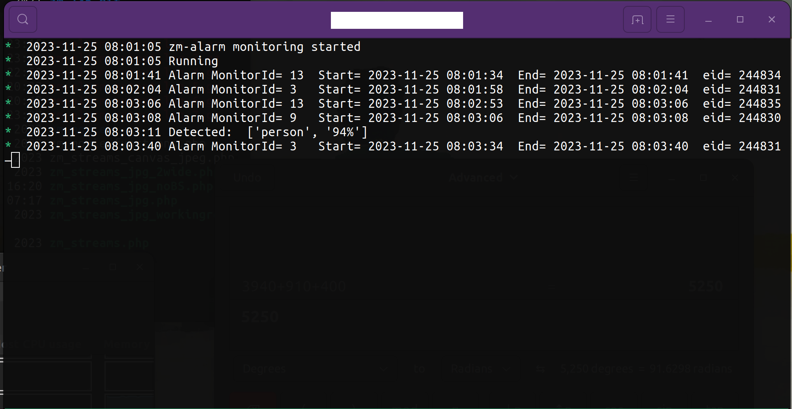
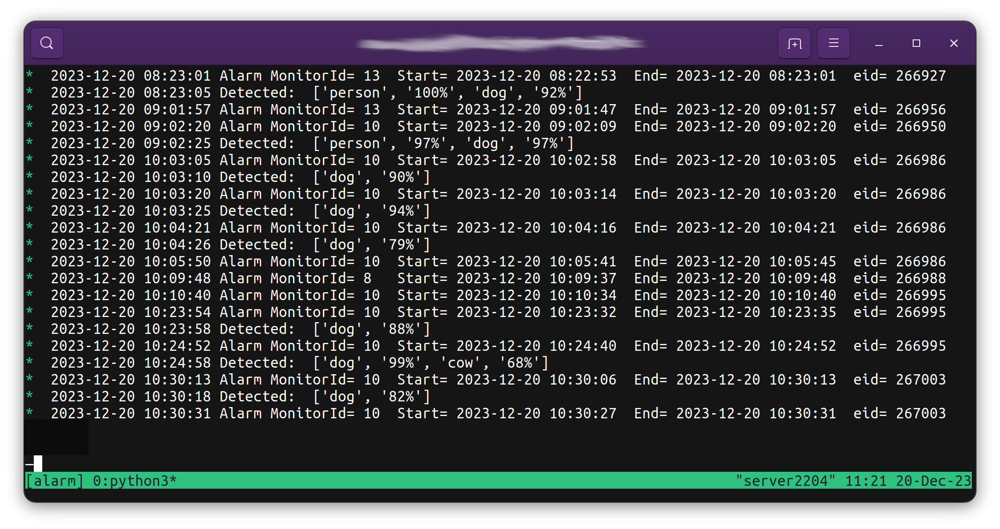

# zm-alarm
Python3 script to process zoneminder alarms with YOLO4 in realtime
Tested on Ubuntu 22.04 and ZM version 1.36.xx

Requirements:
ZM configured for localhost http port 80 access

ZM Auth enabled

ZM API enabled

Ensure "movflags=faststart" is NOT enabled in camera storage
   
Additional packages:
apt get python3-mysqldb python3-numpy python3-opencv

apt get mailutils 

* mail must be setup to use emails

Download files for YOLO4: coco.names, yolov4.cfg, yolov4.weights

 
Usage:$token_json = shell_exec('curl -k -XPOST -d "user=admin&pass=password" https://localhost/zm/api/host/login.json');
After updating settings (lines 38 to 86 in script), simply start the python script

Recommend to run script as normal user in home folder to simplify permissions.

e.g. python3 /home/user/zm-alarm_02.py

The script can either email or store to a folder of your choice a JPG of the object detected.

# zm_streams
Zoneminder camera montage displays streams at 1 fps. No limits on number of cameras.

The montage can show/hide cameras  by clicking the buttons and also be reodered by dragging the buttons.

Installation:

Copy file zm_streams_0a.php to webserver HTML folder (e.g. /var/www/html/)

Ensure proper permissions (e.g. www-data)

Edit line 5 zoneminder loging credentials user and pass: $token_json = shell_exec('curl -k -XPOST -d "user=admin&pass=password" https://localhost/zm/api/host/login.json');

Ensure the file /etc/zm.conf is readable by the web server (e.g. owner or group: www-data, r)

Load page from your web browser

NOTE: I am not a programmer and the scripts do not follow any standards.
